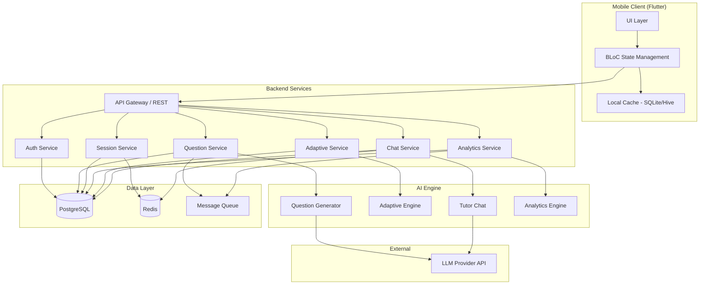

# Design Document: ACT AI Tutor App

## Overview

The ACT AI Tutor App is a cross-platform mobile application built with Flutter that delivers adaptive ACT test preparation through AI-powered question generation, real-time tutoring, and performance analytics. The system comprises a Flutter frontend communicating with a backend API layer that orchestrates an LLM-based AI Engine for question generation, adaptive learning, and conversational tutoring.

The architecture follows a clean separation between the presentation layer (Flutter), application logic (backend API services), and data persistence (database + cache). The AI Engine is decomposed into four subsystems: Question Generator, Adaptive Engine, Tutor Chat, and Analytics Engine — each with well-defined interfaces and responsibilities.

### Key Design Decisions

1. **Flutter for cross-platform**: Single codebase for iOS and Android with native performance
2. **Backend API with LLM orchestration**: Centralized AI processing ensures consistency, allows model upgrades without app updates, and protects API keys
3. **Event-driven performance tracking**: Each answer submission triggers an event pipeline that updates the Weakness Profile and Analytics asynchronously
4. **Offline-first with conflict resolution**: Local caching with last-write-wins (most recent response per question) for seamless connectivity handling
5. **Stateless backend services with session state in database**: Enables horizontal scaling to support 1000+ concurrent students

## Architecture



### Communication Flow

1. **Client → API**: REST over HTTPS with JWT bearer tokens
2. **API → AI Engine**: Internal gRPC or direct function calls (depending on deployment)
3. **AI Engine → LLM**: HTTP calls to LLM provider with structured prompts
4. **Event Pipeline**: Answer submissions publish events to a message queue consumed by Analytics and Adaptive services asynchronously

### Scalability Approach

- **Horizontal scaling**: Stateless backend services behind a load balancer
- **Caching**: Redis for active session state, chat context, and frequently accessed question metadata
- **Async processing**: Performance record updates and analytics recalculations happen asynchronously via message queue
- **Connection pooling**: Database connection pools sized for 1000+ concurrent users

## Components and Interfaces

### 1. Flutter Mobile Client

**Responsibilities**: UI rendering, local state management, offline caching, synchronization

```dart
// BLoC pattern for state management
abstract class AuthBloc {
  Stream<AuthState> get state;
  void register(RegisterRequest request);
  void login(LoginRequest request);
  void logout();
}

abstract class PracticeBloc {
  Stream<PracticeState> get state;
  void startSession(Section section);
  void startMixedSession();
  void submitAnswer(String questionId, String selectedOption);
  void requestHint(String questionId);
  void endSession();
}

abstract class FullTestBloc {
  Stream<FullTestState> get state;
  void startTest(Section section);
  void selectAnswer(int questionIndex, String selectedOption);
  void navigateToQuestion(int index);
  void submitTest();
  void resumeTest(String sessionId);
}

abstract class TutorChatBloc {
  Stream<ChatState> get state;
  void sendMessage(String text);
  void sendImage(File image);
  void loadHistory();
}

abstract class AnalyticsBloc {
  Stream<AnalyticsState> get state;
  void loadDashboard();
}

abstract class ParentBloc {
  Stream<ParentState> get state;
  void loadLinkedStudents();
  void selectStudent(String studentId);
  void sendLinkInvitation(String studentEmail);
}
```

### 2. Auth Service

**Responsibilities**: Registration, login, password hashing, session management, account linking

```
POST /api/auth/register
  Body: { name, email, password, role, grade?, targetScore? }
  Response: { userId, token }

POST /api/auth/login
  Body: { email, password }
  Response: { userId, token, role }

POST /api/auth/link-student
  Body: { parentId, studentEmail }
  Response: { invitationId, status }

POST /api/auth/accept-link
  Body: { invitationId, studentId }
  Response: { status }
```

### 3. Question Service

**Responsibilities**: Question generation orchestration, Question Bank management

```
POST /api/questions/generate
  Body: { section, difficultyLevel, skillTag? }
  Response: { questionId, questionText, options, skillTag, difficulty }
  Timeout: 8 seconds

GET /api/questions/{questionId}
  Response: { questionId, questionText, options, correctAnswer, explanation, skillTag, difficulty, strategyTip }

GET /api/questions/batch
  Body: { section, count, difficultyLevel? }
  Response: { questions: [...] }
```

### 4. Session Service

**Responsibilities**: Practice and Full Test session lifecycle management

```
POST /api/sessions/practice/start
  Body: { userId, section, mode }
  Response: { sessionId, firstQuestion }

POST /api/sessions/practice/submit
  Body: { sessionId, questionId, selectedAnswer, timeTaken }
  Response: { isCorrect, explanation?, nextQuestion? }

POST /api/sessions/practice/end
  Body: { sessionId }
  Response: { summary: { totalQuestions, correct, avgTime } }

POST /api/sessions/fulltest/start
  Body: { userId, section }
  Response: { sessionId, questions, timeLimit }

POST /api/sessions/fulltest/submit
  Body: { sessionId, answers: [{questionIndex, selectedAnswer}] }
  Response: { score, details: [...] }

POST /api/sessions/fulltest/save-progress
  Body: { sessionId, answers: [...], currentIndex }
  Response: { status }

POST /api/sessions/fulltest/resume
  Body: { sessionId }
  Response: { questions, answers, timeRemaining, currentIndex }
```

### 5. Adaptive Service

**Responsibilities**: Weakness profiling, difficulty selection, error classification, study plan generation

```
GET /api/adaptive/profile/{userId}
  Response: { weaknessProfile: [{ skillTag, accuracy, attempts }] }

GET /api/adaptive/next-difficulty/{userId}/{skillTag}
  Response: { difficulty, timeLimit?, includeExplanation? }

POST /api/adaptive/classify-error
  Body: { userId, questionId, isCorrect, timeTaken }
  Response: { classification: "concept_gap" | "careless_mistake" | "pacing_issue" }

POST /api/adaptive/study-plan
  Body: { userId }
  Response: { dailyTargets, weeklyGoals, projectedScoreRange }

POST /api/adaptive/pacing-drill
  Body: { userId, skillTag }
  Response: { questions, timeLimits }
```

### 6. Chat Service

**Responsibilities**: Conversational AI tutoring, image processing, context management

```
POST /api/chat/message
  Body: { userId, sessionId, text }
  Response: { reply, isHint }
  Timeout: 5 seconds

POST /api/chat/image
  Body: multipart { userId, sessionId, image }
  Response: { extractedQuestion, reply }
  Timeout: 10 seconds

GET /api/chat/history/{sessionId}
  Response: { messages: [...] }  // up to 50 messages
```

### 7. Analytics Service

**Responsibilities**: Score trends, accuracy computation, timing analysis, weakness ranking

```
GET /api/analytics/dashboard/{userId}
  Response: { scoreTrends, weakSkills, avgTimePerSection, accuracyPerSection }

GET /api/analytics/parent/{parentId}/{studentId}
  Response: { totalTime, sessions, overallAccuracy, trends, weakSkills }
```

## Data Models

### Users Table

| Field | Type | Constraints |
|-------|------|-------------|
| user_id | UUID | Primary Key |
| name | VARCHAR(100) | NOT NULL, 1-100 chars |
| email | VARCHAR(255) | NOT NULL, UNIQUE |
| password_hash | VARCHAR(255) | NOT NULL |
| password_salt | VARCHAR(64) | NOT NULL |
| role | ENUM('student', 'parent') | NOT NULL |
| grade | INTEGER | NULL (students only) |
| target_score | INTEGER | NULL (students only) |
| failed_login_attempts | INTEGER | DEFAULT 0 |
| locked_until | TIMESTAMP | NULL |
| created_at | TIMESTAMP | NOT NULL |
| updated_at | TIMESTAMP | NOT NULL |

### Parent_Student_Links Table

| Field | Type | Constraints |
|-------|------|-------------|
| link_id | UUID | Primary Key |
| parent_id | UUID | FK → Users |
| student_id | UUID | FK → Users, NULL until accepted |
| student_email | VARCHAR(255) | NOT NULL |
| status | ENUM('pending', 'accepted', 'rejected') | NOT NULL |
| created_at | TIMESTAMP | NOT NULL |

### Questions Table (Question Bank)

| Field | Type | Constraints |
|-------|------|-------------|
| question_id | UUID | Primary Key |
| section | ENUM('english', 'math', 'reading', 'science') | NOT NULL |
| question_text | TEXT | NOT NULL |
| passage | TEXT | NULL (for Reading/English) |
| options | JSONB | NOT NULL, array of 4 choices |
| correct_answer | CHAR(1) | NOT NULL, A/B/C/D |
| explanation | TEXT | NOT NULL |
| incorrect_reasoning | JSONB | NOT NULL |
| skill_tag | VARCHAR(100) | NOT NULL |
| difficulty | ENUM('easy', 'medium', 'hard') | NOT NULL |
| strategy_tip | TEXT | NOT NULL |
| created_at | TIMESTAMP | NOT NULL |

### Sessions Table

| Field | Type | Constraints |
|-------|------|-------------|
| session_id | UUID | Primary Key |
| user_id | UUID | FK → Users |
| session_type | ENUM('practice', 'full_test') | NOT NULL |
| section | ENUM('english', 'math', 'reading', 'science', 'mixed') | NOT NULL |
| status | ENUM('active', 'completed', 'interrupted', 'expired') | NOT NULL |
| started_at | TIMESTAMP | NOT NULL |
| completed_at | TIMESTAMP | NULL |
| time_limit_seconds | INTEGER | NULL (full test only) |
| time_remaining_seconds | INTEGER | NULL (for resume) |
| expires_at | TIMESTAMP | NULL (interrupted sessions: started_at + 24h) |

### Performance_Records Table

| Field | Type | Constraints |
|-------|------|-------------|
| record_id | UUID | Primary Key |
| user_id | UUID | FK → Users |
| session_id | UUID | FK → Sessions |
| question_id | UUID | FK → Questions |
| selected_answer | CHAR(1) | NULL (skipped = NULL) |
| is_correct | BOOLEAN | NOT NULL |
| time_taken_seconds | REAL | NOT NULL |
| error_classification | ENUM('concept_gap', 'careless_mistake', 'pacing_issue', NULL) | NULL |
| timestamp | TIMESTAMP | NOT NULL |

### Weakness_Profiles Table

| Field | Type | Constraints |
|-------|------|-------------|
| profile_id | UUID | Primary Key |
| user_id | UUID | FK → Users |
| skill_tag | VARCHAR(100) | NOT NULL |
| section | ENUM('english', 'math', 'reading', 'science') | NOT NULL |
| accuracy | REAL | NOT NULL, 0.0-1.0 |
| attempt_count | INTEGER | NOT NULL |
| recent_attempts | JSONB | NOT NULL, array of last 20 results |
| updated_at | TIMESTAMP | NOT NULL |
| UNIQUE(user_id, skill_tag) | | |

### Study_Plans Table

| Field | Type | Constraints |
|-------|------|-------------|
| plan_id | UUID | Primary Key |
| user_id | UUID | FK → Users |
| daily_targets | JSONB | NOT NULL |
| weekly_goals | JSONB | NOT NULL |
| projected_score_range | JSONB | NOT NULL |
| created_at | TIMESTAMP | NOT NULL |
| valid_until | TIMESTAMP | NOT NULL |

### Chat_Sessions Table

| Field | Type | Constraints |
|-------|------|-------------|
| chat_session_id | UUID | Primary Key |
| user_id | UUID | FK → Users |
| messages | JSONB | NOT NULL, array up to 50 |
| created_at | TIMESTAMP | NOT NULL |
| updated_at | TIMESTAMP | NOT NULL |

## Correctness Properties

*A property is a characteristic or behavior that should hold true across all valid executions of a system — essentially, a formal statement about what the system should do. Properties serve as the bridge between human-readable specifications and machine-verifiable correctness guarantees.*

### Property 1: Registration Input Validation

*For any* registration input, the validation function SHALL accept the input if and only if: name length is between 1 and 100 characters, email conforms to standard email format, and password is at least 8 characters containing at least one uppercase letter, one lowercase letter, and one digit.

**Validates: Requirements 1.1**

### Property 2: Login Error Opacity

*For any* invalid login attempt (wrong email, wrong password, or both wrong), the error response SHALL be identical regardless of which field is incorrect — never revealing whether the email exists or the password is wrong.

**Validates: Requirements 1.4**

### Property 3: Account Lockout Threshold

*For any* sequence of N consecutive failed login attempts for the same account, the account SHALL be locked if and only if N >= 5, and the lock duration SHALL be exactly 15 minutes.

**Validates: Requirements 1.5**

### Property 4: Password Hashing Uniqueness

*For any* two users with the same password, their stored password hashes SHALL be different (due to unique salts), and for any password the stored hash SHALL not equal the original plaintext.

**Validates: Requirements 1.7**

### Property 5: Question Structure Completeness

*For any* generated question, the output SHALL contain all required fields: question_text (non-empty), exactly 4 options, a correct_answer (A/B/C/D), a non-empty explanation, incorrect_reasoning for each wrong option, a valid skill_tag, a valid difficulty (Easy/Medium/Hard), and a strategy_tip.

**Validates: Requirements 2.1, 2.6**

### Property 6: Skill Tag Section Validity

*For any* generated question with a given section, the assigned skill_tag SHALL belong to the predefined valid set for that section and no other section's set.

**Validates: Requirements 2.7**

### Property 7: Practice Mode Section Filtering

*For any* Practice_Mode session with a selected section, every question presented SHALL belong to that selected section.

**Validates: Requirements 3.2**

### Property 8: Performance Record Completeness

*For any* answer submission, the resulting Performance_Record SHALL contain a valid user_id, question_id, is_correct (matching whether selected_answer equals the question's correct_answer), time_taken (> 0), and a timestamp.

**Validates: Requirements 3.8**

### Property 9: Session Summary Accuracy

*For any* set of Performance_Records in a practice session, the session summary SHALL report: total_questions equal to the count of records, number_correct equal to the count where is_correct is true, and average_time equal to the mean of all time_taken values.

**Validates: Requirements 3.9**

### Property 10: Timer Expiry Auto-Submit

*For any* Full_Test_Mode session with a mix of answered and unanswered questions at timer expiry, the system SHALL submit all answered questions with their selected answers and mark all unanswered questions as skipped (selected_answer = NULL, is_correct = false).

**Validates: Requirements 4.6**

### Property 11: Full Test Score Computation

*For any* completed Full_Test_Mode session, the score summary SHALL report the number of correct answers equal to the count of questions where the student's selected_answer matches the correct_answer, out of the total question count for that section.

**Validates: Requirements 4.7**

### Property 12: Interrupted Session State Preservation

*For any* Full_Test_Mode session that is interrupted at any point, all answers recorded prior to interruption SHALL be preserved and retrievable when the session is resumed within 24 hours.

**Validates: Requirements 4.9**

### Property 13: Weakness Profile Sliding Window

*For any* sequence of attempts for a given Skill_Tag, the Weakness_Profile accuracy SHALL equal the number of correct attempts divided by total attempts in the most recent 20 attempts (or all attempts if fewer than 20 exist), and each new attempt SHALL cause this recalculation.

**Validates: Requirements 5.1, 5.2**

### Property 14: Error Classification Logic

*For any* incorrect answer where the student has demonstrated prior competence (accuracy > 80% on that Skill_Tag with 5+ attempts), the classification SHALL be Careless_Mistake. *For any* incorrect answer where the student has accuracy <= 80% or fewer than 5 prior attempts on that Skill_Tag, the classification SHALL be Concept_Gap. *For any* answer (correct or incorrect) where response time exceeds 2× the median response time for that difficulty level, the classification SHALL include Pacing_Issue.

**Validates: Requirements 5.3**

### Property 15: Adaptive Difficulty Selection

*For any* Skill_Tag and student profile: IF attempt_count < 5 THEN difficulty SHALL be Medium; IF attempt_count >= 5 AND accuracy < 0.60 THEN difficulty SHALL be Easy; IF attempt_count >= 5 AND 0.60 <= accuracy <= 0.80 THEN difficulty SHALL be Medium with 90-second time limit; IF attempt_count >= 5 AND accuracy > 0.80 THEN difficulty SHALL be Hard with 60-second time limit.

**Validates: Requirements 5.4, 5.5, 5.6, 5.9**

### Property 16: Pacing Drill Time Progression

*For any* pacing drill with N questions (5 <= N <= 10), the time limit for question i (0-indexed) SHALL equal 120 - (i × 10) seconds, forming a strictly decreasing sequence.

**Validates: Requirements 5.7**

### Property 17: Study Plan Structure

*For any* generated Study_Plan, it SHALL contain between 3 and 10 daily practice targets for each Skill_Tag with accuracy below 60%, weekly goals with measurable accuracy thresholds, and a projected score range consisting of a lower and upper bound.

**Validates: Requirements 5.8**

### Property 18: Chat Context Window

*For any* chat session, the system SHALL retain all messages up to 50 messages. *For any* chat session with more than 50 messages, only the most recent 50 SHALL be retained in context.

**Validates: Requirements 6.7**

### Property 19: Message Length Validation

*For any* text message with length exceeding 1000 characters, the Tutor_Chat SHALL reject the message. *For any* text message with length between 1 and 1000 characters, the Tutor_Chat SHALL accept and process the message.

**Validates: Requirements 6.8**

### Property 20: Score Trend Computation

*For any* set of Performance_Records over the most recent 30 days, the score trend SHALL plot one accuracy data point per day per section, where each data point equals the number of correct answers divided by total answers for that section on that day.

**Validates: Requirements 7.1**

### Property 21: Weak Skill Tag Ranking

*For any* set of Weakness_Profiles, the weak skills list SHALL contain at most 10 Skill_Tags where accuracy < 0.60, ordered from lowest accuracy to highest accuracy.

**Validates: Requirements 7.2, 8.4**

### Property 22: Average Time Per Section

*For any* set of Performance_Records within the most recent 30 days, the average time per section SHALL equal the sum of time_taken divided by the count of records for that section.

**Validates: Requirements 7.3**

### Property 23: Accuracy Per Section

*For any* set of Performance_Records within the most recent 30 days, the accuracy per section SHALL equal the count of records where is_correct is true divided by the total count of records for that section.

**Validates: Requirements 7.4, 8.3**

### Property 24: Insufficient Data Threshold

*For any* section where a student has fewer than 5 Performance_Records, the Analytics Dashboard SHALL display an insufficient data message for that section instead of computed metrics.

**Validates: Requirements 7.6**

### Property 25: Parent Dashboard Aggregation

*For any* linked student's Performance_Records, the parent dashboard SHALL display: total_time equal to the sum of all time_taken values, total_sessions equal to the count of distinct session_ids, and overall_accuracy equal to total correct divided by total records across all sections.

**Validates: Requirements 8.1**

### Property 26: Parent Access Control

*For any* parent-student link, the parent SHALL have access to the student's data if and only if the link status is 'accepted'. Links with status 'pending' or 'rejected' SHALL NOT grant data access.

**Validates: Requirements 8.5**

### Property 27: No Feedback During Full Test

*For any* answer submission during an active Full_Test_Mode session, the system SHALL NOT return correctness information (is_correct, explanation, or correct_answer) until the session status changes to 'completed'.

**Validates: Requirements 9.6**

### Property 28: Sync Conflict Resolution

*For any* conflict between local and server Performance_Records for the same question within the same session, the record with the most recent timestamp SHALL be preserved, and the older record SHALL be discarded.

**Validates: Requirements 10.3**

## Error Handling

### Client-Side Error Handling

| Error Scenario | Handling Strategy |
|----------------|-------------------|
| Network timeout on question generation (>8s) | Display error with retry/change-section options (Req 2.10) |
| Network interruption during session | Cache responses locally in SQLite, show sync pending indicator (Req 10.3) |
| Sync failure after reconnection | Retry 3 times at 10-second intervals, show pending indicator (Req 10.4) |
| Image upload processing failure | Display error, prompt for clearer image or text input (Req 6.3) |
| Message exceeds 1000 characters | Reject client-side before sending, show character limit error (Req 6.8) |
| Session interrupted (exit/crash) | Preserve all recorded answers, allow resume within 24 hours (Req 4.9) |
| Invalid registration input | Show field-specific validation errors (Req 1.1) |
| Duplicate email registration | Show "email already in use" error (Req 1.2) |

### Server-Side Error Handling

| Error Scenario | Handling Strategy |
|----------------|-------------------|
| LLM provider timeout/failure | Return error to client, log incident, circuit-breaker pattern for repeated failures |
| Database write failure | Retry with exponential backoff (max 3 attempts), return error to client if all fail |
| Authentication failure | Return generic "invalid credentials" error (Req 1.4), increment failure counter |
| Account locked | Return "account temporarily locked" with remaining lockout time (Req 1.5) |
| Concurrent session conflict | Last-write-wins based on timestamp (Req 10.3) |
| Question generation invalid output | Validate LLM output structure, retry once, then return error |
| Session expiry (24h for interrupted) | Mark as incomplete on next access attempt (Req 4.10) |

### Resilience Patterns

- **Circuit Breaker**: On LLM provider for question generation and chat — open after 5 consecutive failures, half-open after 30 seconds
- **Retry with Backoff**: Database operations and sync operations
- **Graceful Degradation**: If analytics computation is delayed, show last cached values with timestamp
- **Idempotency Keys**: For answer submissions to prevent duplicate Performance_Records on retry

## Testing Strategy

### Unit Tests

Unit tests verify specific examples, edge cases, and error conditions:

- **Auth**: Valid/invalid registration inputs, login success/failure, lockout counter reset on success, password hash verification
- **Question Validation**: Individual question structure checks, section-specific format validation
- **Session Management**: Session state transitions (active → completed, active → interrupted → expired)
- **Adaptive Engine**: Specific difficulty selection scenarios, error classification examples with known inputs
- **Analytics**: Edge cases (zero records, exactly 5 records, boundary accuracy values like 59.9% and 60.0%)
- **Parent Dashboard**: Access control for different link statuses, empty state displays
- **Sync**: Conflict resolution with specific timestamp orderings

### Property-Based Tests

Property-based tests verify universal properties across all inputs using a PBT library (e.g., `fast-check` for the TypeScript backend or `dart_check` for Flutter/Dart logic):

- Minimum **100 iterations** per property test
- Each test tagged with: **Feature: act-ai-tutor-app, Property {number}: {property_text}**
- Generators produce random but valid:
  - Registration inputs (names, emails, passwords of varying validity)
  - Question structures with random sections, difficulties, skill tags
  - Performance record sequences with varying correctness and timing
  - Weakness profiles with random accuracy values and attempt counts
  - Chat message sequences of varying length
  - Timestamp-ordered conflict scenarios

**Key property tests to implement:**
1. Registration validation (Property 1)
2. Password hashing (Property 4)
3. Weakness profile sliding window (Property 13)
4. Error classification (Property 14)
5. Adaptive difficulty selection (Property 15)
6. Pacing drill progression (Property 16)
7. Weak skill ranking (Property 21)
8. Accuracy computation (Property 23)
9. Session summary accuracy (Property 9)
10. Conflict resolution (Property 28)

### Integration Tests

- **LLM Integration**: Verify question generation produces valid output for each section (2-3 examples per section)
- **Database**: CRUD operations for all tables, concurrent write handling
- **Sync Pipeline**: End-to-end offline → online sync with conflict scenarios
- **Chat**: Image upload processing pipeline
- **Timer**: Full test auto-submission on expiry

### End-to-End Tests

- Complete student registration → practice → analytics flow
- Full test session start → answer → submit → score review
- Parent link invitation → acceptance → dashboard viewing
- Offline usage → reconnection → sync verification

### Performance Tests

- 1000+ concurrent students: question retrieval < 3 seconds (Req 10.5)
- Question generation: < 8 seconds (Req 2.1)
- Chat response: < 5 seconds for text, < 10 seconds for images (Req 6.1, 6.2)
- Data sync on new device: < 10 seconds (Req 10.2)

